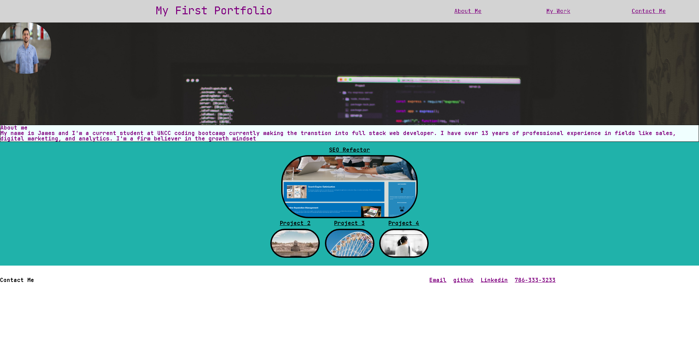

# Advanced CSS Portfolio

## Table of Contents
1. [Description](#description)
2. [Visuals](#visuals)
3. [Resources](#resources)

## Description
Built a portfolio using only html and advanced CSS to showcase projects up to this point in the coding bootcamp.This project highlights some of the core skills I recently learned like flexbox, media quieries, and CSS viables. Since I only have one project I used place holders for future projects.

## Visuals
 

# Resources
- [Live Site](https://n3330.github.io/02-homework/)
- [A Guide To Flexbox](https://css-tricks.com/snippets/css/a-guide-to-flexbox/) 